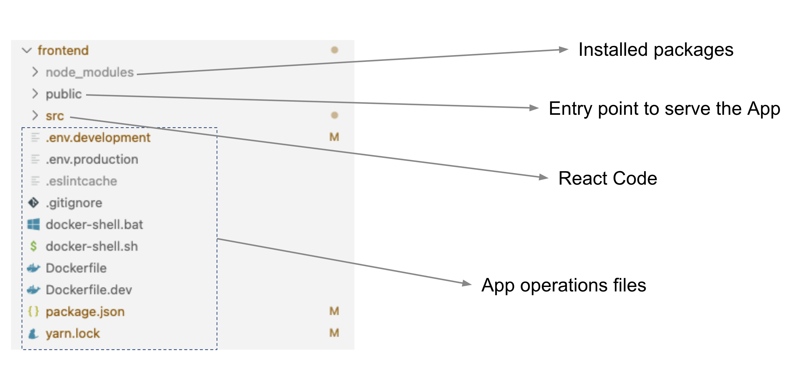
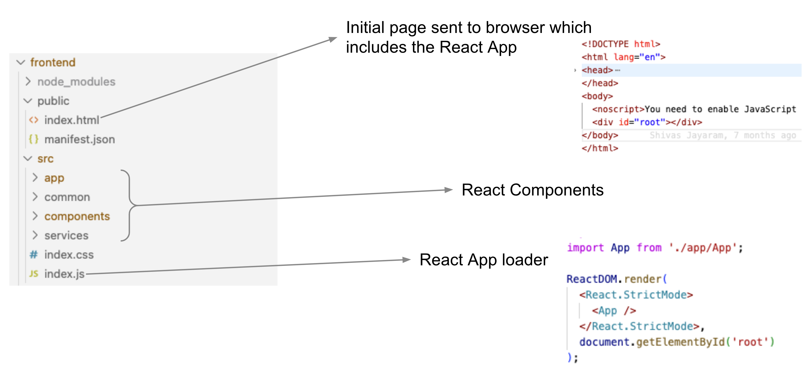
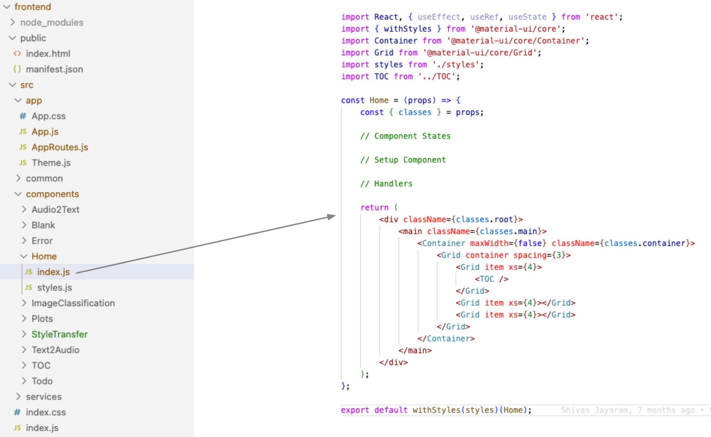
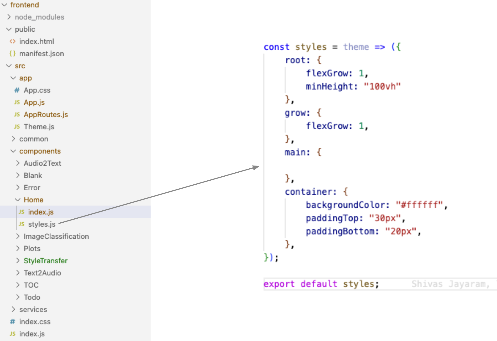
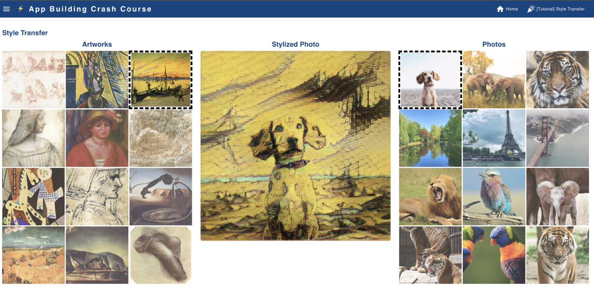

# ⚡ App Building Crash Course

In this tutorial we will go over a react app template and learn:
* How to structure a React App
* Integrate API calls to the backend from the frontend
* Create components

## Prerequisites
* Have Docker installed
* Have VSCode or an IDE of choice

### Clone the github repository
- Clone or download from [app-building-crashcourse](https://github.com/dlops-io/app-building-crashcourse)

### Go into the frontend folder 
- Open a terminal and go to the location where `app-building-crashcourse/frontend`

### Build & Run Container
- Run `sh docker-shell.sh` or `docker-shell.bat` for windows

### Install React packages
- If this is your first time running the react container run `yarn install`

### Start Web Server
- Run `yarn start` from the docker shell
- Go to `http://localhost:3000`

If you can see the web page at `http://localhost:3000`, you have your environment setup and ready to follow along for this tutorial.

## Code Organization

### Overview









## App Layout & View
### Change the Fav Icon and browser title
* Go to `public/index.html`
* Change Fav icon using `<link rel="icon">...</link>` tag
* Change Title using `<title>...</title>` tag

### Change the App theme color 
* Pick a suitable App base theme color from https://colorbrewer2.org/#type=sequential&scheme=PuBu&n=9
* Open the file `src/app/Theme.js`
* Change the color from `#084081` to your selected App theme base color

### Change App Icon and Title
* Reference for emojis: https://emojipedia.org/
* Reference for icons: https://fonts.google.com/icons?selected=Material+Icons
* Open the file `src/common/Header/index.js`
* Change App Header Icon + Title at line 56-58
```
<Typography className={classes.appTitle} >
    ⚡ App Building Crash Course
</Typography>
```
## References for Components
* MUI Components: https://v4.mui.com/components/lists/

## 🎉 [Tutorial] Style Transfer

### Create a new React Component
* Copy the folder `src/components/Blank` -> `src/components/StyleTransfer`
* Open the file `src/components/StyleTransfer/index.js` and replace all `Blank` with `StyleTransfer`

### Add App Route to access the new Component
* Open the file `src/app/AppRoutes.js`
* Add an import reference to the new StyleTransfer component
```
import StyleTransfer from "../components/StyleTransfer";
```
* Add the route by adding this tag to the list of `Route` tags
```
<Route path="/styletransfer" exact component={StyleTransfer} />
```
* Go the the new `styletransfer` route and verify you can see the new component
* It should say `This is a blank page...` for now

### Add styles for the Component
* Open the file `src/components/StyleTransfer/style.js`
* Add the following styles after `container` style:
```
gridList: {
        height: 650,
    },
    thumbnailImage: {
        opacity: 0.80,
        '&:hover': {
            opacity: 1
        }
    },
    predictionImage: {
        height: 0,
        paddingTop: '100%',
        opacity: 0.7,
    },
    progressBar: {
        position: "absolute",
        top: "300px",
        left: "48%",
        color: "#ffffff"
    },
    media: {
        height: 0,
        paddingTop: '100%',
    },
```

### Create states to hold data in Component
* Open the file `src/components/StyleTransfer/index.js`
* Add the following states under `// Component States`
```
const [numImages, setNumImages] = useState(12);
const [contentImages, setContentImages] = useState([]);
const [styleImages, setStyleImages] = useState([]);
const [selectedContentImage, setSelectedContentImage] = useState(null);
const [selectedStyleImage, setSelectedStyleImage] = useState(null);
const [prediction, setPrediction] = useState(null);
```

* Add the following after the states you defined above
```
    const loadContentImages = () => {
        DataService.StyleTransferGetContentImages()
            .then(function (response) {
                console.log(response.data);
                setContentImages(shuffle(response.data));
            })
    }
    const loadStyleImages = () => {
        DataService.StyleTransferGetStyleImages()
            .then(function (response) {
                console.log(response.data);
                setStyleImages(shuffle(response.data));
            })
    }
    const applyStyleTransfer = () => {

        setPrediction(null);

        if (selectedStyleImage && selectedContentImage) {
            DataService.StyleTransferApplyStyleTransfer(selectedStyleImage, selectedContentImage)
                .then(function (response) {
                    try {
                        console.log(response.data);
                        setPrediction(response.data);

                    } catch (e) {
                        console.log(e)
                    }
                })
        }

    }
```

### Load data on component load
* Call the following methods in your `useEffect(....);` block as shown:
```
useEffect(() => {
    loadContentImages();
    loadStyleImages();
}, []);
```

### Add User Interaction Methods
* Add the following user on click handlers:
```
// Handlers
const styleImageClicked = (img) => {
    setSelectedStyleImage(img);
}
const contentImageClicked = (img) => {
    setSelectedContentImage(img);
}
```
* Add the following useEffects (Whens some state changes)
```
useEffect(() => {
        applyStyleTransfer();
    }, [selectedContentImage, selectedStyleImage]);
```

### Add the following Util Methods
```
// Methods
const shuffle = (data) => {
    return data
        .map((a) => ({ sort: Math.random(), value: a }))
        .sort((a, b) => a.sort - b.sort)
        .map((a) => (a.value))
        .slice(0, numImages)
}
const isThumnailHighlited = (image, row) => {
    var style = {};

    var selectedStyle = {
        border: "5px dashed #000000",
        opacity: 1
    }

    if (image && (row == image)) {
        style = selectedStyle
    }

    return style;
}
```

### Create the Component UI pieces

#### Add the required imports
* Add the following to the top of your file 
```
import Grid from '@material-ui/core/Grid';
import GridList from '@material-ui/core/GridList';
import GridListTile from '@material-ui/core/GridListTile';
import Card from '@material-ui/core/Card';
import CardMedia from '@material-ui/core/CardMedia';
import CardContent from '@material-ui/core/CardContent';
import CircularProgress from '@material-ui/core/CircularProgress';

```

#### Add a Title for your page
* Replace the current `Typography` with the following:
```
<Typography variant="h5" gutterBottom>Style Transfer</Typography>
```
* You should be able to see the new title of you page

#### Add a Grid Layout for your page
* Add the following layout code right after ``
```
<Grid container spacing={3}>
    <Grid item xs={4}>Left</Grid>
    <Grid item xs={4}>Middle</Grid>
    <Grid item xs={4}>Right</Grid>
</Grid>
```
* You should be able to see a 3 column layout

#### Display the Artworks Images in the left panel
* Replace the text `Left` with the following code:
```
                            <Typography variant="h5" gutterBottom align="center">
                                Artworks
                            </Typography>
                            <GridList cellHeight={160} className={classes.gridList} cols={3} spacing={3}>
                                {styleImages.map(img => (
                                    <GridListTile key={img}
                                        onClick={(e) => styleImageClicked(img)}
                                        className={classes.thumbnailImage}
                                        style={isThumnailHighlited(selectedStyleImage, img)}>
                                        
                                    </GridListTile>
                                ))}
                            </GridList>
```
* You should be able to see the images on the left

#### Display the Photos in the right panel
* Replace the text `Right` with the following code:
```
                            <Typography variant="h5" gutterBottom align="center">
                                Photos
                            </Typography>
                            <GridList cellHeight={160} className={classes.gridList} cols={3} spacing={3}>
                                {contentImages.map(img => (
                                    <GridListTile key={img}
                                        onClick={(e) => contentImageClicked(img)}
                                        className={classes.thumbnailImage}
                                        style={isThumnailHighlited(selectedContentImage, img)}>
                                        
                                    </GridListTile>
                                ))}
                            </GridList>
```
* You should be able to see the images on the right

#### Display the Prediction in the middle panel
* Replace the text `Middle` with the following code:
```
                            <Typography variant="h5" gutterBottom align="center">
                                Stylized Photo
                            </Typography>
                            {selectedStyleImage && selectedContentImage && (
                                <Card>
                                    {selectedContentImage && !prediction && (
                                        <CardMedia
                                            className={classes.predictionImage}
                                            image={DataService.StyleTransferGetImage(selectedContentImage)}
                                            title="Original image"
                                        />
                                    )}
                                    {selectedContentImage && !prediction && (
                                        <CircularProgress className={classes.progressBar} />
                                    )}
                                    {prediction && (
                                        <CardMedia
                                            className={classes.media}
                                            image={DataService.StyleTransferGetImage(prediction.stylized_image)}
                                            title="Stylelized image"
                                        />
                                    )}
                                </Card>
                            )}
                            {
                                !selectedStyleImage && !selectedContentImage && (
                                    <CardContent>
                                        <Typography align="center" variant="body2">
                                            <strong>Select an artwork and photo to see the style of the artwork get applied to the photo</strong>
                                        </Typography>
                                    </CardContent>
                                )
                            }
```


### 🎉 Congratulations we have the new component ready, now lets test it
* Select a style image from the left
* Select a photo in the right
* What do you see?

Here is a screenshot of the completed App:



## References: Getting Started

* Intro to HTML: https://www.w3schools.com/html/html_intro.asp
* Intro to Javascript: https://www.w3schools.com/js/js_intro.asp
* Intro to React: https://medium.com/javascript-scene/the-missing-introduction-to-react-62837cb2fd76
* Getting started with React: https://reactjs.org/docs/getting-started.html


