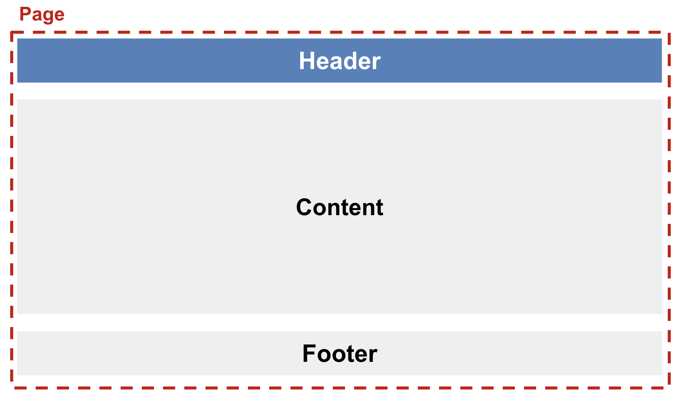
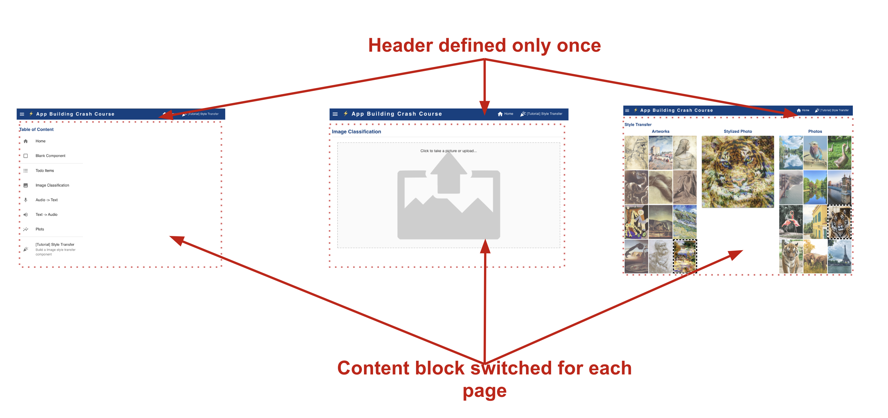
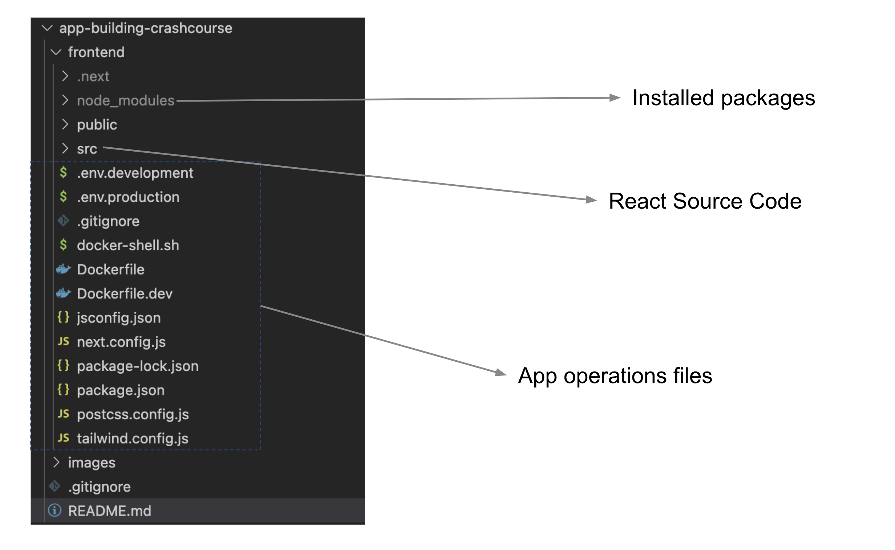
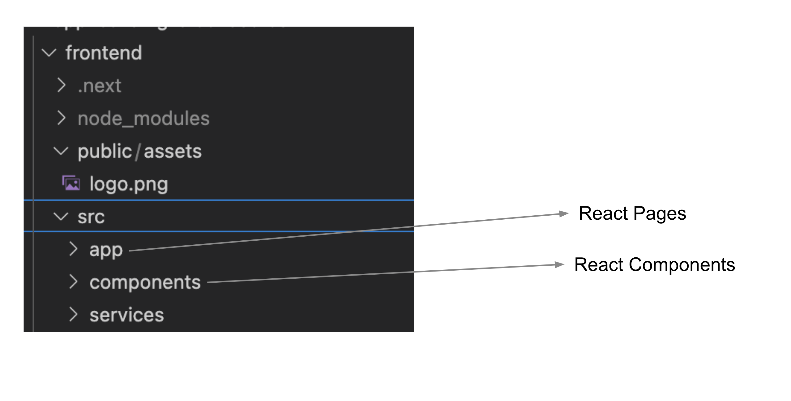
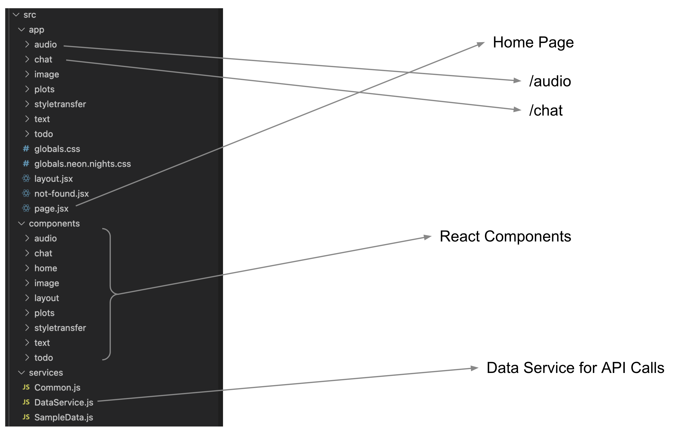

# ⚡ App Building Crash Course

In this tutorial we will go over a react app template and learn:
* How to structure a React App
* What are pages and components
* Review various components like:
    * Audio input
    * Audio output
    * Image input
    * Plots and graphs
    * Chat UI

## Prerequisites
* Have Docker installed
* Have VSCode or an IDE of choice

### Clone the github repository
- Clone or download from [app-building-crashcourse](https://github.com/dlops-io/app-building-crashcourse)

### Go into the frontend folder 
- Open a terminal and go to the location where `app-building-crashcourse/frontend`

### Build & Run Container
- Run `sh docker-shell.sh`

### Install Required packages
- If this is your first time running the react container run `npm install`

### Start Web Server
- Run `npm run dev` from the docker shell
- Go to `http://localhost:3000`

If you can see the web page at `http://localhost:3000`, you have your environment setup and ready to follow along for this tutorial.

## Code Organization

### React App Structure
In a React app we want to break things up in an app into components to make the development and maintenance fo the app easier

Common components like header, footer, navigation bars are only built once. The core page component in a page is swapped out different app views

### Code Structure
The general organization of a react app is as follows.

## References: Getting Started
* Intro to HTML: https://www.w3schools.com/html/html_intro.asp
* Intro to Javascript: https://www.w3schools.com/js/js_intro.asp
* Intro to React: https://medium.com/javascript-scene/the-missing-introduction-to-react-62837cb2fd76
* Getting started with React: https://reactjs.org/docs/getting-started.html
* Getting started with Next: https://nextjs.org/docs/app/getting-started
* CSS: Tailwind for React: https://tailwindui.com/documentation#react-creating-components 

